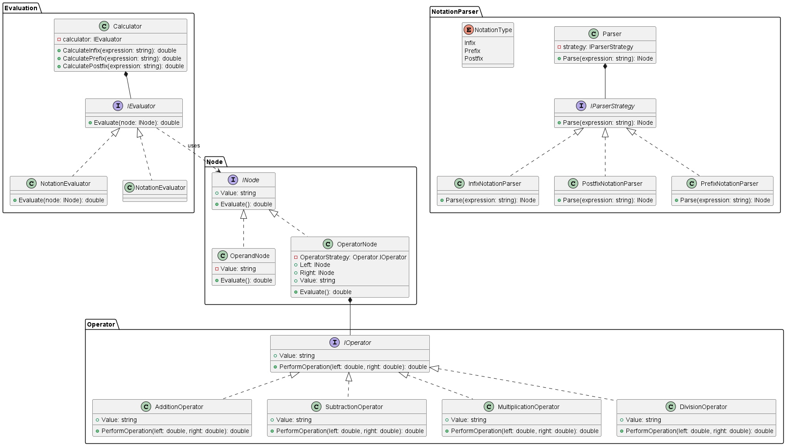

# Calculation-Module

計算用のモジュールです。前置記法、中置記法、後置記法に対応しています。

## はじめに

このモジュールは、様々な記法で表された数学的表現を解析し、計算を行うためのライブラリです。プログラムは C#で書かれており、拡張性と再利用性を意識した設計がなされています。

## 環境

-   .NET 5.0 以上
-   C# 9.0 以上

## 使用方法

### 基本計算

Caliculate クラスを通して簡単に計算することができます。

```csharp
var expression = "1 + 1";
var calculator = new Calculator();
var result = calculator.CalculateInfix(expression);
// result 2.0
```

また、`(`,`)`を用いて計算することもできます。

同様に後置記法や前置記法の計算にも対応しています。

```csharp
var result = calculator.CalculatePrefix(expression);
var result = calculator.CalculatePostfix(expression);
```

### 構文解析

また`Parser`クラスを利用することで構文解析のみを行うことも可能です。

```csharp
var expression = "3 4 +";
var parser = new Parser(new PostfixNotationParser());
var node = parser.Parse(expression);

Console.WriteLine(node.Value); // 出力: +
Console.WriteLine(node.Left.Value); // 出力: 3
Console.WriteLine(node.Right.Value); // 出力: 4
```

### 演算子の拡張

演算子は現状 `+`,`-`,`*`,`/`に対応しています。  
`IOperator`インターフェースを継承することで新たな演算子を追加できます。  
作成したファイルは必ず Calculation アセンブリ内においてください。自動で認識され構文解析が行われるようになります。  
下記にべき乗の拡張例を示します。

```csharp
public sealed class ExponentiationOperator : IOperator
{
    private static string OperatorValue => "**";
    public string Value => OperatorValue;

    public double PerformOperation(double left, double right)
    {
        return Math.Pow(left,right);
    }
}
```

## テスト方法

このモジュールには、単体テストが含まれています。テストを実行するには、以下のコマンドを使用します。

```shell
dotnet test
```

## クラス設計



## 参考資料

https://smdn.jp/programming/tips/polish/
